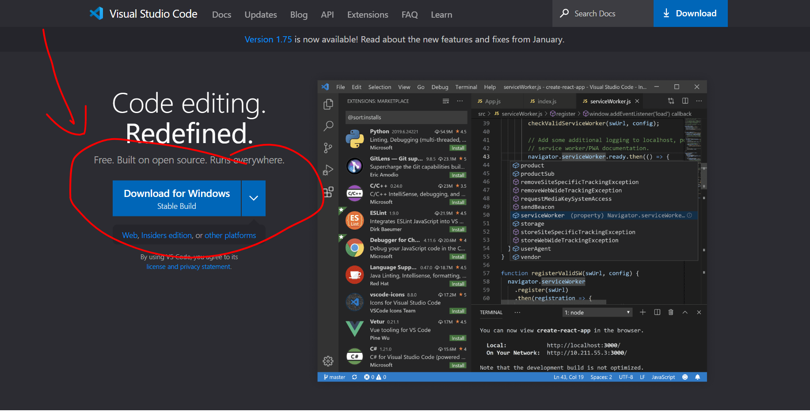

# 01 - Getting Started

## Introduction

Welcome to LemLib! This tutorial will walk you through the basics of LemLib and how to get everything set up.

## Installation - Development Environment

LemLib is a [PROS](https://pros.cs.purdue.edu) template, so you can use it with any text editor. However, we recommend using Visual Studio Code, as it has the best support for PROS.

To install visual studio code, go to [https://code.visualstudio.com](https://code.visualstudio.com) and download the installer for your operating system

Once you have installed it, open it and install the PROS extension. You can do this by clicking typing `Ctrl+Shift+X`, searching for "pros", and clicking the install button. 

And finally, we can create a new project. Navigate to the new PROS tab on the left, and click the "Create New Project" button. Select a folder, a name, v5, and when asked to select a version, select "latest".

Now you are ready to start coding!

## Installation - LemLib Template

To install LemLib, you need to download its zip file from [here](https://github.com/SizzinSeal/LemLib/releases/download/v0.3.3/LemLib@0.3.3.zip). Next you need to drag the zip file into your pros project file. See the image below for an example 